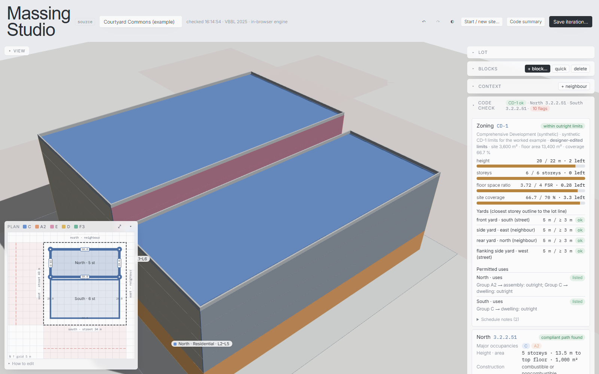

# Massing Studio

**Live: https://clcabana.github.io/massing-studio/**

## 1. Purpose

Massing Studio lets an architect or architecture student draw a building massing on a Vancouver lot
and read, as they drag, what Part 3 of the **Vancouver Building By-law 2025** makes of it: the
governing 3.2.2 construction article and the headroom left before it flips, building height and
area, spatial separation for every exposing face, and target numbers for occupant load, exits, exit
width and washrooms. Every line cites its clause and PDF page and says why in plain language.

It is for early design, when storeys, footprint and setbacks are still moving and a code
consultant's review is weeks away. It answers "if I add a storey, what changes?" in seconds.

> This is a **draft generator for a registered professional's review**, not a compliance determination.

Built in the UBC M.Arch course ARCH 540 (AI Workflows) as a Claude project, then moved here to keep building.

## 2. How to use it

### The web page (no install)

1. Open **https://clcabana.github.io/massing-studio/**. The whole rule engine runs in your browser;
   nothing is sent to a server.
2. In the **Set up the site** dialog pick **Worked example** to load Courtyard Commons, or
   **Describe the site** to answer a few questions (frontage, depth, which edges face a street, grade)
   and then **+ block…** to add a building from a preset.
3. Drag a corner or a wall tag in the **Plan** panel (lower left), or change storeys, setbacks and
   glazing in the **Blocks** dropdown (right). The **Code check** dropdown re-runs on every change;
   its header shows the governing article per block and the flag count.
4. **Code summary** (top right) opens the printable sheet. **Save iteration…** keeps the massing in
   this browser's localStorage so you can reopen and compare it later.

The parcel map and the Rhino round trip need the local server and are switched off on the page.

### The local app (parcel map, Excel code summaries, Rhino)

Needs Python 3.11 or newer. From a clone of this repository:

```bash
pip install -r requirements.txt
python -m app.server --port 8765
```

Then open http://127.0.0.1:8765. The local app adds **Pick a site on the map**: the lot, plus the
neighbouring buildings with LiDAR heights, the street trees and the street names, all from City of
Vancouver Open Data. It saves iterations on disk under `projects/` with an Excel code summary each
(**Export to Excel** in the Code summary dialog does the same for the massing on screen),
and the **Rhino** panel exports a `.3dm`; edit the storeys in Rhino 7/8, save, and the analysis
updates. `rhino3dm` is already in the requirements.

`CODESHEET_FIXTURE=1 python -m app.server` serves a synthetic block of lots so the map picker works
offline. If the port is busy the server exits with "only one usage of each socket address"; pass
another `--port`.

These steps were run on Windows 11 with Python 3.12 on 2026-10-02: 79 tests pass, the server answers
on a fresh port, and the published page loads the worked example. See
[app/README.md](app/README.md) for the full tour of the UI and the Rhino layer convention.

## 3. Source

**Vancouver Building By-law 2025** (VBBL 2025), City of Vancouver. The engine labels every citation
`VBBL 2025 (cons. 2026-01-01)`, the consolidation the text was extracted from, and gives the page in
the Volume 1 PDF. Two parts of the by-law are used:

- **Division A, 1.4.1.2 Defined terms** (PDF pp. 32–43): building area, building height, basement,
  first storey, grade, limiting distance, mezzanine, storey.
- **Division B, Part 3 Fire Protection, Occupant Safety and Accessibility**: all 569 articles of
  3.1 through 3.10 (PDF pp. 122–420) are extracted to
  [data/bylaw/vbbl-2025/articles.json](data/bylaw/vbbl-2025/articles.json) by
  [codesheet/bylaw_extract.py](codesheet/bylaw_extract.py); Table 3.2.3.1-B and -C are parsed to
  [table_3231_BC.json](data/bylaw/vbbl-2025/table_3231_BC.json).

The rules actually evaluated, with the clause each one reads:

| What the tool reports | Clause, table or diagram | PDF page |
|---|---|---|
| Occupancy group of each use | Table 3.1.2.1 | 122 |
| Fire separation between major occupancies, Notes (3) and (4) | Table 3.1.3.1 | 124 |
| Occupant load per storey | Table 3.1.17.1, 3.1.17.1.(1)(b) | 169 |
| What counts as a storey; parkade as a separate building | 3.2.1.1.(1), 3.2.1.2 | 172–173 |
| Multiple and superimposed major occupancies, 10 % subsidiary test | 3.2.2.6, 3.2.2.7, 3.2.2.8 | 175–176 |
| Governing construction article and headroom, Group C | 3.2.2.47 to 3.2.2.55 | 188–193 |
| Governing construction article, Group A Division 2 (incl. Table 3.2.2.25) | 3.2.2.23 to 3.2.2.28 | 180–182 |
| Governing construction article, Group E (incl. Table 3.2.2.70) | 3.2.2.66 to 3.2.2.71 | 198–200 |
| Sprinklers required in new buildings (Vancouver amendment) | 3.2.2.18.(3) | 178 |
| Permitted unprotected openings per exposing face and storey | 3.2.3.1, Tables 3.2.3.1-B, -C, -D | 211–217 |
| Wall rating, construction and cladding of the exposing face | 3.2.3.7, Table 3.2.3.7 | 219 |
| Number of exits, one-exit criteria | 3.4.2.1, Table 3.4.2.1 | 285 |
| Travel distance limit | 3.4.2.5 | 288 |
| Exit width, aggregate and per stair | 3.4.3.2, Table 3.4.3.2-A | 289 |
| Water closets, lavatories, urinal and unisex alternatives | 3.7.2.2 Tables -A/-B/-C, 3.7.2.3 | 317–319 |
| Gender-neutral washroom count (Vancouver amendment) | 3.7.2.9 | 320 |

The by-law PDFs are **not** in the repository; the extracted JSON is enough to run everything. The
clause links in the HTML sheet open the PDF only when it sits beside the sheet; the Excel workbook
cites the clause and page in their own columns.

## 4. One example

**Input.** The worked example, *Courtyard Commons* (synthetic, chosen so the answers can be worked by
hand). A 60 × 60 m lot, grade 10.00 m, streets on the south (34 m right-of-way) and west (40 m),
neighbours east and north, sprinklered. Two blocks separated by a firewall and a 2 m gap:

| Block | Storeys | Uses | Footprint |
|---|---|---|---|
| North | 5 | L1 dining hall, kitchen, auditorium and offices (A2); L2–L5 student suites (C), 24 sleeping rooms per floor | 50 × 20 m, 1,000 m² |
| South | 6 | rental suites (C), 16 sleeping rooms per floor | 50 × 28 m, 1,400 m² |

Glazing is 25 % on every North face and 35 % on every South face.

**Result** (the Code check panel on the published page, 2026-10-02):



- **North: 3.2.2.51** *Group C, up to 6 Storeys, Sprinklered*, compliant path found. Headroom:
  5 / 6 storeys (1 left), 13.5 / 18 m to top floor (4.5 m left), 1,000 / 1,800 m² (800 m² left).
  One more storey still lands on 3.2.2.51.
- **South: 3.2.2.51**, compliant path found, but with no headroom in storeys: 6 / 6, 16.5 / 18 m,
  1,400 / 1,500 m². One more storey would push it to **3.2.2.48** (noncombustible).
- **Exposing faces.** The 2 m gap puts an imaginary line 1 m from each block, so only **11.7 %**
  of those two faces may be unprotected openings; the drawn 25 % and 35 % fail (red), and the walls
  need FRR ≥ 60 min with noncombustible cladding. The street faces at 22 m and 25 m have no
  exposing-face requirement.
- **Occupancy separation.** North L1/L2, A2 below C above: **2 h** (Table 3.1.3.1 Note (3)).
- **Targets.** North 184 persons, South 180; 2 exits per storey, travel ≤ 45 m, stairs sized at
  1,100 mm each, doors 850 mm; one water closet per dwelling unit.
- **6 flags**, including "Group A2 present, admitted within 3.2.2.51 per Sentence (5)(a) below the
  3rd storey; confirm the storey condition" and the two opening-area exceedances.

Drag the South block away from the North block and the permitted percentage on the two
imaginary-line faces rises with the limiting distance, until the red bands clear.

## 5. Skill and limits

**Where the reusable part is.** There is no separate skill file in this repository. The reusable
piece is the rule engine itself: [codesheet/](codesheet/) (Python, pure functions over
[data/bylaw/](data/bylaw/)) and its browser port [app/static/engine.js](app/static/engine.js).
Python is the source of truth; `tests/test_engine_js.py` fails if the two drift.
`codesheet.massing.analyze_massing()` takes a massing spec and returns every determination with its
clauses, so it can be driven from a notebook, a script or another UI.

**What the tool does not do, and where a person must check:**

- It is a draft for a registered professional. Every determination carries a `because` and the
  clause; read them, do not just read the colour.
- Blocks are assumed firewall-separated (each block is its own building). Confirm the firewall
  exists and runs full height, including across any courtyard.
- Glazing is a ratio per face, not a window schedule. Openings protected per 3.2.3.10–.12 are not modelled.
- Exit *layout* (3.3, 3.4.2.3–.4), dead ends and washroom accessibility layout (3.8) are out of scope
  by design. Exit counts and widths are targets to design to, not a check of a plan.
- Only Groups C, A2 and E have a 3.2.2 ladder. Other major occupancies are classified, but the tool
  proposes no article for them and flags "determine the governing article manually". Table 3.2.2.68
  is not extracted.
- Bedrooms are estimated at 1 per 35 m² until you enter them; occupant loads for A2 spaces are not
  determined until you give an area per person or a seat count.
- Lots picked from the map have their street / lane / neighbour edge kinds inferred geometrically.
  Check them in the Lot panel; a corner cut or an odd parcel can fool it. Neighbouring buildings and
  trees are context for the 3D view only and do not enter the analysis.
- Vancouver-specific amendments beyond 3.2.2.18.(3) and 3.7.2.9 are not separately flagged. The
  BCBC 2024 edition key exists but no text has been extracted for it.

## For developers

    codesheet/      the rule engine: Python 3.11+, pydantic 2, pure functions over data/
    app/            FastAPI server, the UI (static/index.html), engine.js (the JavaScript port),
                    build_pages.py (this site) and build_artifact.py (the Claude artifact)
    data/bylaw/     VBBL 2025 Part 3 articles and Table 3.2.3.1-B/-C extracted to JSON
    data/projects/  two synthetic projects: Courtyard Commons (the golden project) and a lane mixed-use lot
    tests/          hand-worked golden values, tables, occupant-load and egress targets, JS ↔ Python parity
    viz/            plotly sections, elevations and 3D massing for the printed sheet
    docs/           the README screenshot

```bash
python -m pytest -q                        # the JS parity tests need node on the PATH
python app/build_pages.py                  # → out/site/index.html
```

Every push to `main` runs the tests, builds `out/site` and deploys it to GitHub Pages
([.github/workflows/pages.yml](.github/workflows/pages.yml)). After changing any table or ladder in
Python, run `codesheet/export_engine_data.py` to regenerate the shared JSON, then mirror the change
in `engine.js`.
